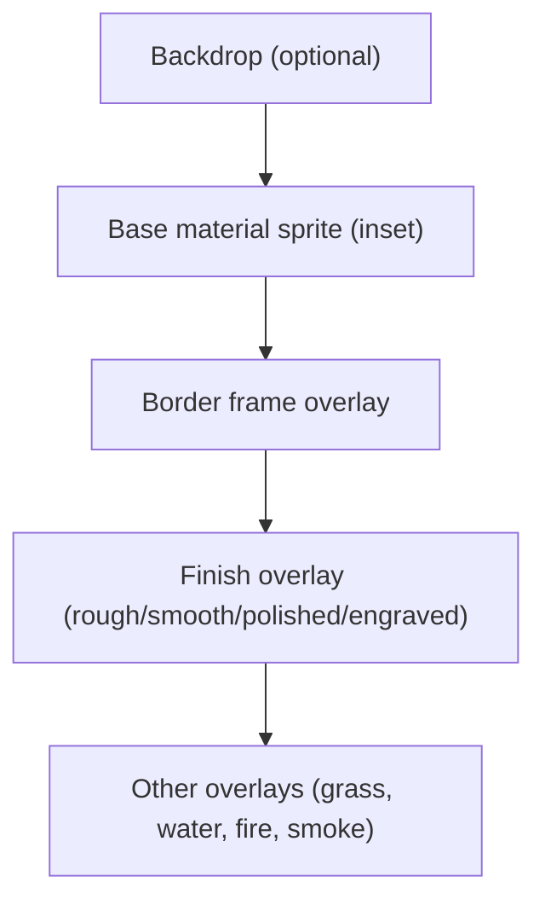
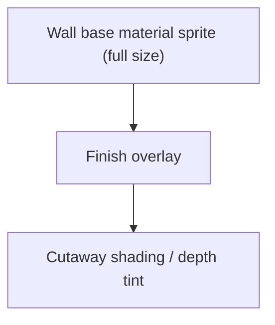

# Material + Finish Overlays (Design Doc)

Goal: reduce sprite explosion by reusing base material sprites for floors/walls/items and layering a small set of **finish overlays** (rough/smooth/polished/engraved) + optional **border frames**.

This document is a design plan only — no implementation yet.

---

## 1) Problem Summary

Today, every diggable cell type tends to need:
- A unique **item sprite** (for stockpiles)
- A unique **floor sprite** (after digging)

This balloons art work as we add materials. We want a more scalable visual system:
- **Reuse base material sprites** for floors/walls/items
- Add **finish overlays** and/or **border frames** to communicate state (rough/smooth/polished/etc)

---

## 2) Shared Understanding / Desired Look

You described this specifically:
- When you dig out clay, **reuse the clay cell sprite** for the floor.
- **Scale it down a tiny bit** and draw a **border** around it.
- Optional: draw a **backdrop** behind it for non‑rect cells.
- Finish overlays are **transparent sprites** with subtle noise (rough = speckles), drawn *over* the base material.

We are aligned on that.

---

## 3) Current System (Relevant Pieces)

**Materials**
- `wallMaterial` and `floorMaterial` grids in `src/world/material.c`.
- `wallNatural` and `floorNatural` flags track natural vs constructed.

**Rendering**
- `DrawCellGrid()` in `src/render/rendering.c` draws:
  1) depth walls (z-3/z-2)
  2) floor from below (z-1)
  3) constructed floors
  4) current layer walls
  5) cutaway shading

**Material sprites**
- `MaterialWallSprite()` and `MaterialFloorSprite()` map materials to sprites.
- Walls already use *materials* + tints; floors are separate sprites.

**Items**
- Each diggable material has its own item sprite: `ITEM_DIRT`, `ITEM_CLAY`, etc.
- Rendering tints items by material (`MaterialTint`).

---

## 4) Design Goals

1. **Reduce art workload**: 1 base sprite per material category.
2. **Finish states** (rough/smooth/polished/engraved) should be visible without new base sprites.
3. **Reuse base material sprite** for both walls and floors.
4. **Avoid shimmering/gaps** when scaling or insetting.
5. **Minimal engine complexity** while keeping performance stable.

---

## 5) Proposed Visual Model

### 5.1 Layers (per tile)

**For floors:**
1. **Backdrop (optional)**: solid or lightly textured base, full tile.
2. **Base material sprite**: drawn **inset** (scale down slightly).
3. **Border frame overlay**: thin outline, full tile, transparent center.
4. **Finish overlay**: transparent noise/symbols for rough/smooth/polished/engraved.

**For walls:**
1. Base material sprite (full size)
2. Finish overlay
3. Existing cutaway shading (unchanged)

### 5.2 Inset + Border Specs

- **Inset amount**: 1 px for 8×8, 1–2 px for 16×16.
- **Border overlay**: separate sprite with transparent center.
- **Backdrop** (optional): flat color or subtle pattern to prevent “holes” when inset.

### 5.3 Finish Overlays (What It Means)

Finish overlays are small transparent sprites drawn **over** the base material:
- **ROUGH**: speckle noise / jagged pixels
- **SMOOTH**: faint cross‑hatching or clean subtle highlight
- **POLISHED**: stronger highlight streaks / small shine
- **ENGRAVED**: line art or glyph marks

These overlays are material‑agnostic.

---

## 6) Data Model Additions

### 6.1 Finish enum
```
SurfaceFinish = ROUGH | SMOOTH | POLISHED | ENGRAVED
```

### 6.2 Grids
- `wallFinish[z][y][x]`
- `floorFinish[z][y][x]`

**Defaults**
- Natural terrain: `ROUGH`
- Constructed floors/walls: `SMOOTH`

---

## 7) Rendering Plan (Detailed)

### 7.1 Base Material Rendering (No new sprites per material)
- Floors use **same base sprite as the material** (e.g., clay uses clay sprite).
- Wall sprites already do this via `MaterialWallSprite()`.

### 7.2 Floor Rendering Pass (Z-1 floor)
When drawing floor from below (DF-style):
- Draw **backdrop** (optional, full tile)
- Draw **base material inset**
- Draw **border overlay**
- Draw **finish overlay**

### 7.3 Constructed Floors
- Same pipeline as above, but material from `floorMaterial` and finish from `floorFinish`.

### 7.4 Walls
- Walls remain full‑size; draw finish overlays **after** walls are drawn and **before** cutaway shading.

### 7.5 Non‑Rect Cells (Ramps, Ladders)
- Skip inset + border for ramps/ladders.
- Optionally use finish overlay only (keeps them readable).

---

## 7.6 Rendering Stack Diagram



Walls are similar but skip inset/border by default:



---

## 8) Item Rendering (Reduce Sprite Count)

### 8.1 Minimal change
Keep item types (`ITEM_DIRT`, `ITEM_CLAY`, etc.) but point them all to the **same base sprite** and rely on `MaterialTint()` for differentiation.

### 8.2 Larger change (Optional)
Replace with a single `ITEM_MATERIAL_CHUNK` that is fully material‑driven. This is a deeper change (stockpile filters, item names, etc.).

---

## 9) Save/Load and Migration

- Add finish grids to save files.
- On load from older saves, infer:
  - if `IsFloorNatural` → `ROUGH`
  - else → `SMOOTH`

---

## 10) Risks + Mitigations

**Risk: Shimmering or edge gaps due to inset + zoom**
- Mitigation: clamp inset to integer pixels, round destination coords.

**Risk: Art readability for ramps/diagonals**
- Mitigation: skip borders on ramps; use finish overlays only.

**Risk: Over‑dark borders**
- Mitigation: keep border alpha low or theme‑color it (slight tint).

---

## 11) Finish Names + Art Direction (Proposed)

### 11.1 Naming (Code + Art)
Recommended enum names:
- `FINISH_ROUGH`
- `FINISH_SMOOTH`
- `FINISH_POLISHED`
- `FINISH_ENGRAVED`

Sprite file naming:
- `finish_rough`
- `finish_smooth`
- `finish_polished`
- `finish_engraved`
- `tile_border` (optional)

### 11.2 Art Direction (Specific)

Overall rule: overlays are **mostly transparent** and should not fight the base material. The finish should read as a *surface treatment*, not a material change.

ROUGH
- Look: tiny jagged speckles, irregular dots, slightly darker than base.
- Pattern density: low‑medium, avoid full noise fill.
- Purpose: communicate “unworked” or “natural” surface.

SMOOTH
- Look: subtle cross‑hatching or a faint, clean edge highlight.
- Pattern density: low.
- Purpose: communicate “worked / cleaned” but not shiny.

POLISHED
- Look: clear highlight streaks, tiny gleam marks (2–3 per tile max).
- Pattern density: very low, but higher contrast.
- Purpose: communicates shine or refined surface.

ENGRAVED
- Look: thin line art, simple glyphs, or shallow groove patterns.
- Pattern density: sparse, avoid busy texture.
- Purpose: decorative detail without changing material identity.

### 11.3 Border Frame Style

Default: 1px outline with 1px inset on 8×8 tiles, 1–2px inset on 16×16 tiles.
- Border alpha low (soft). It should **frame**, not dominate.
- Border color: neutral dark or slightly material‑tinted.

### 11.4 Backdrop (Optional)

Use a subtle flat fill to avoid “holes” when the base is inset:
- Floor backdrop: dark neutral (slightly warmer than shadow color).
- Only needed if inset + transparent borders feel too “floaty”.

---

## 12) Open Questions

1. Do we want a **border overlay only** (no base inset), or **inset + border** as the default?
2. What is the final **finish set**? (Rough/Smooth/Polished/Engraved vs just Rough/Smooth)
3. Should **engraving** be a separate overlay that stacks on top of smooth/polished?
4. For non‑rect cells (ramps), should we create special masks or just skip borders entirely?

---

## 13) Recommended First Slice (No Heavy Refactor)

1. Add finish grids + default logic.
2. Add finish overlays to atlas.
3. Update rendering to draw finish overlays.
4. Reuse base material sprite for floors (same as ground).
5. Unify item sprites for diggable materials.

This gives immediate art workload relief with minimal risk.

---

## 14) Visual Checklist (Art)

**New sprites needed**
- `finish_rough`
- `finish_smooth`
- `finish_polished`
- `finish_engraved`
- `tile_border` (optional)

**Existing sprites reused**
- `dirt`, `clay`, `gravel`, `sand`, `peat`, `rock` for floors

---

If this matches your intent, we can move from design to implementation next.
